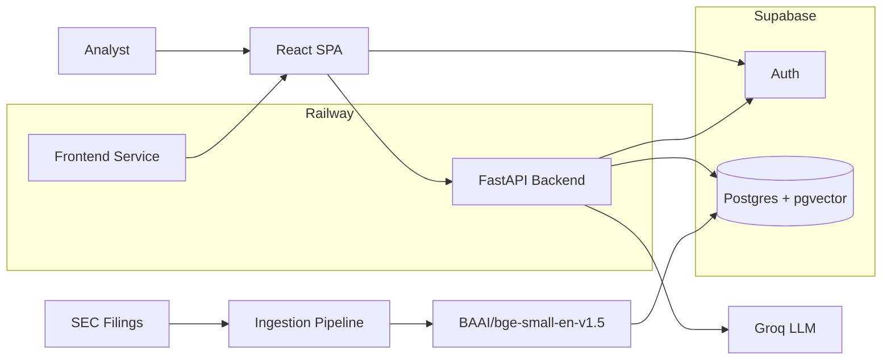

# Document Copilot Architecture (Groq Edition)

## Purpose

Document Copilot is a production-style document intelligence platform designed for analyst research workflows.
The system allows users to query a curated SEC filing corpus using natural language and receive grounded,
citable answers backed by retrieved source passages.

Core principles:

- Retrieval before generation
- Every factual claim must be citable
- Clear refusal when evidence is missing
- Provider-agnostic LLM architecture
- Low-cost deployment suitable for portfolio and demo environments

---

# High-Level Architecture



---

# Architectural Goals

- Thin frontend
- Authoritative backend
- Retrieval-first design
- Grounded responses
- Citation enforcement
- Provider-agnostic LLM layer
- Low operational cost
- Easy deployment

---

# Stack

## Frontend

- Vite
- React
- TypeScript
- React Router
- Tailwind CSS
- shadcn/ui
- Supabase JS SDK
- Vercel AI SDK

## Backend

- Python 3.12+
- FastAPI
- Pydantic v2
- PydanticAI
- SQLAlchemy
- Alembic
- Supabase Python SDK
- Sentence Transformers
- Groq SDK
- httpx
- structlog

## Database

- Supabase Postgres
- pgvector
- Full-text search

---

# LLM Provider Abstraction

The application must never directly depend on a specific inference vendor.

Supported providers:

- Groq
- OpenAI
- Anthropic
- OpenRouter

Initial implementation:

```env
LLM_PROVIDER=groq
MODEL_NAME=llama-3.3-70b-versatile
```

Suggested structure:

```text
backend/app/llm/
├── base.py
├── factory.py
└── providers/
    ├── groq.py
    ├── openai.py
    ├── anthropic.py
    └── openrouter.py
```

Business logic, retrieval, grounding, and persistence must remain independent from the selected provider.

---

# Embeddings

Default embedding model:

```text
BAAI/bge-small-en-v1.5
```

Generated locally using Sentence Transformers.

Advantages:

- No embedding API costs
- No external dependency
- Fast ingestion
- Good retrieval quality for SEC filings

Configuration:

```env
EMBEDDING_MODEL=BAAI/bge-small-en-v1.5
EMBEDDING_DIMENSIONS=384
```

---

# Backend Architecture

```text
backend/app/
├── api/
├── auth/
├── chat/
├── assistant/
├── retrieval/
├── grounding/
├── database/
├── ingestion/
└── llm/
```

## Responsibilities

### chat/

Coordinates a single chat turn.

### assistant/

PydanticAI agents, outputs, dependencies, prompts.

### retrieval/

Hybrid retrieval implementation.

### grounding/

Citation validation and trust enforcement.

### llm/

Provider abstraction layer.

### database/

Persistence and Supabase integration.

---

# Retrieval Strategy

1. Embed query using BGE.
2. Run pgvector semantic search.
3. Run Postgres full-text search.
4. Fuse rankings using Reciprocal Rank Fusion.
5. Fetch supporting chunks.
6. Pass retrieved context to the LLM.

No agent-generated SQL.

Only bounded retrieval tools.

---

# Grounding Rules

The assistant:

- Answers only from retrieved evidence.
- Cites every factual claim.
- Refuses unsupported conclusions.
- Never cites unseen documents.

If citation validation fails:

- Response is rejected.
- Error is returned.

Grounding is enforced in backend code, not only prompts.

---

# Authentication

Supabase Auth is the source of identity.

Frontend:

- Uses anon key
- Stores user session
- Sends JWT to backend

Backend:

- Verifies JWT
- Resolves user identity
- Performs retrieval
- Executes LLM calls

---

# Streaming Flow

1. User sends message.
2. Backend retrieves chunks.
3. Agent generates grounded answer.
4. Text streams to frontend.
5. Citation metadata streams.
6. Final message persists.

Endpoint:

```text
POST /chat/stream
```

---

# Data Model

## profiles

User records

## chat_threads

Conversation metadata

## chat_messages

Messages

## message_citations

Normalized citations

## source_documents

Normalized filings

## document_chunks

Retrieval units containing:

- text
- metadata
- embedding
- tsvector

---

# Configuration

## Backend

```env
SUPABASE_URL=
SUPABASE_ANON_KEY=
SUPABASE_SERVICE_ROLE_KEY=

DATABASE_URL=

GROQ_API_KEY=

LLM_PROVIDER=groq
MODEL_NAME=llama-3.3-70b-versatile

EMBEDDING_MODEL=BAAI/bge-small-en-v1.5
EMBEDDING_DIMENSIONS=384

ALLOWED_ORIGINS=
```

## Frontend

```env
VITE_API_BASE_URL=
VITE_SUPABASE_URL=
VITE_SUPABASE_ANON_KEY=
```

---

# Deployment

Frontend:

- Railway

Backend:

- Railway

Database:

- Supabase

The backend remains stateless.

Embeddings are generated during ingestion and stored in pgvector.

Runtime requests perform retrieval only.

---

# Implementation Sequence

1. Scaffold frontend and backend.
2. Configure Supabase.
3. Add SQLAlchemy models.
4. Add Alembic migrations.
5. Add authentication.
6. Add API client.
7. Add chat streaming.
8. Add ingestion pipeline.
9. Add BGE embeddings.
10. Store vectors in pgvector.
11. Add semantic search.
12. Add full-text search.
13. Add RRF fusion.
14. Add provider-agnostic LLM layer.
15. Add PydanticAI agent.
16. Add citation validation.
17. Add UI for citations.
18. Deploy.

---

# Non-Goals

- Trading recommendations
- Stock picks
- External news
- Social media data
- Multi-tenant architecture
- Direct browser LLM access

---

# Success Criteria

A user can:

1. Login.
2. Ask a question about SEC filings.
3. Receive a grounded answer.
4. Verify citations.
5. Inspect supporting passages.

The system should prioritize trust, transparency, and reproducibility over creativity.
